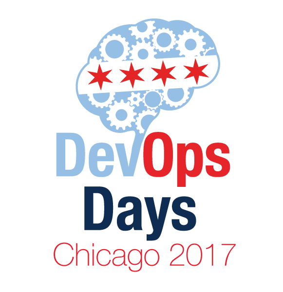
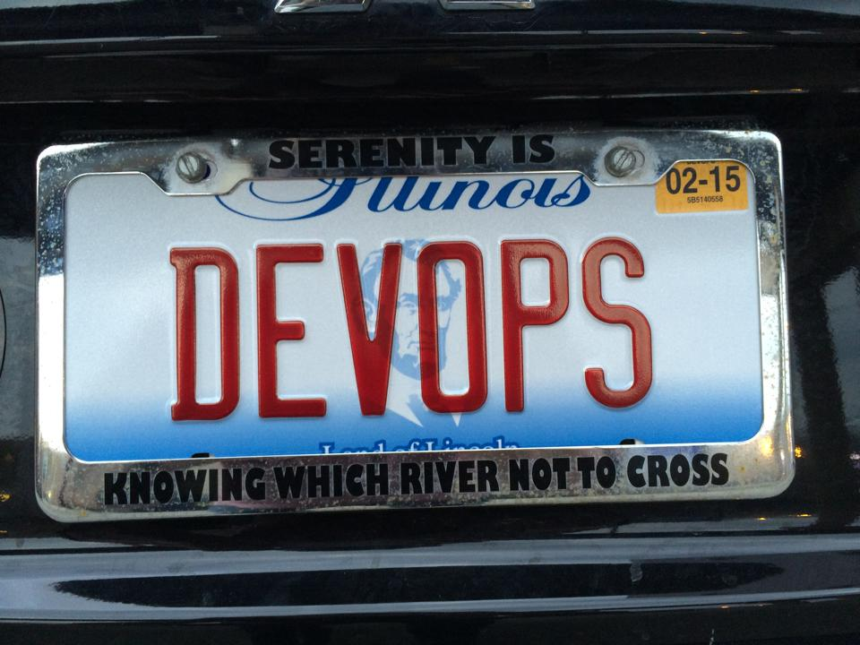
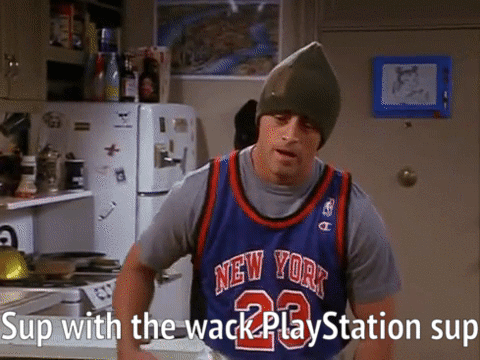
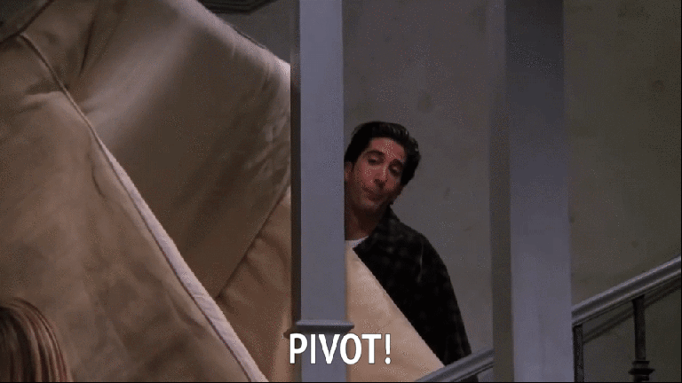
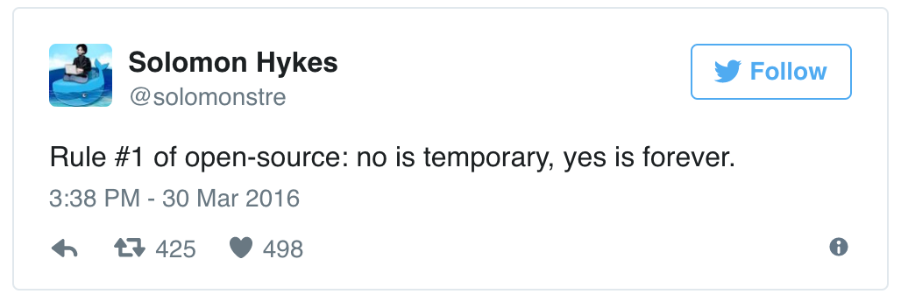
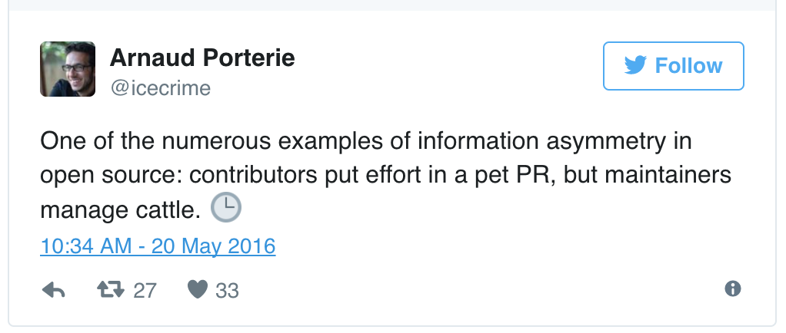
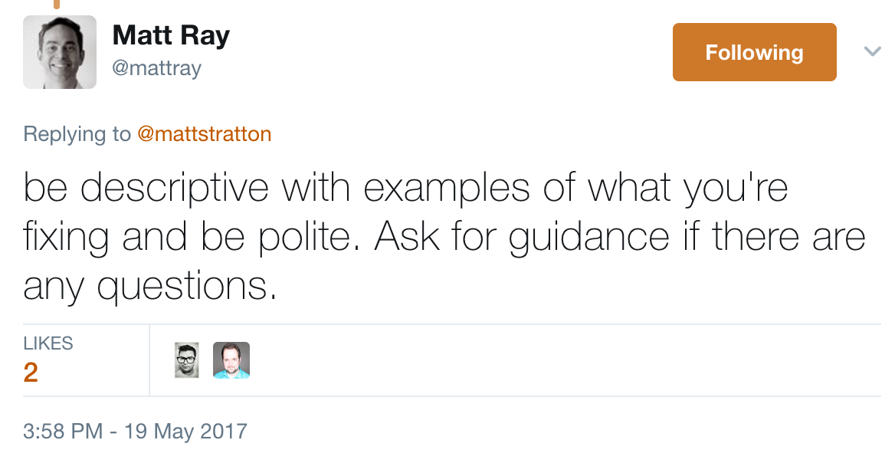
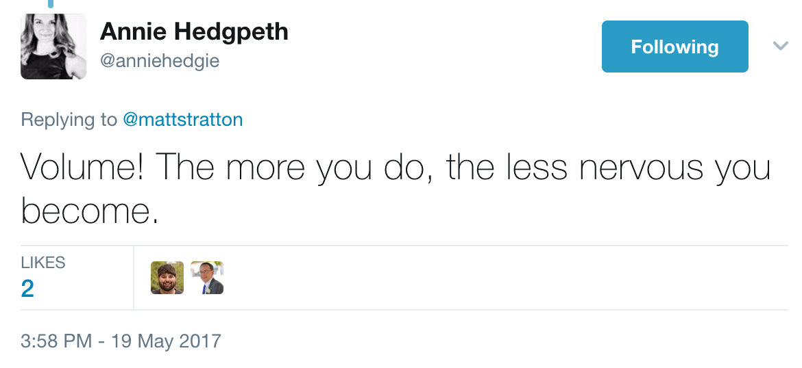
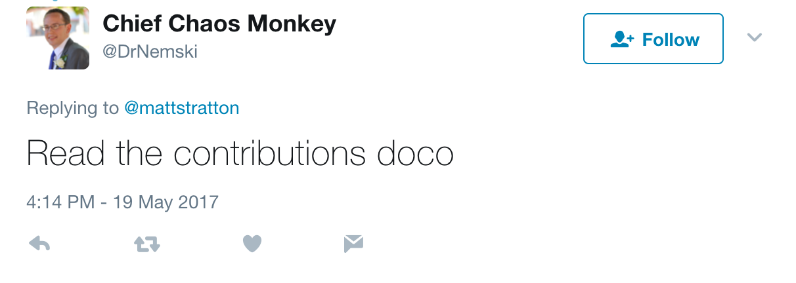
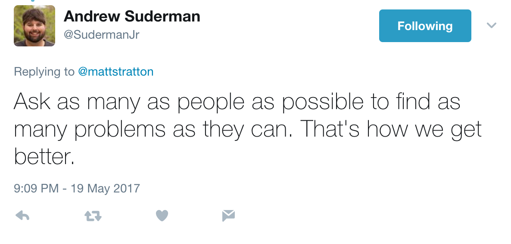

theme: Letters from Sweden, 7
footer: *@mattstratton - ChefConf 2017*

# [fit] The Handwaver's Guide
# [fit] To Contributing To Open Source

---

## whoami




---
[.build-lists: true]
# Who is this talk for?

- Enterprise Architects
- Solution Architects
- Customer Architects
- are you seeing a pattern?

---
[.hide-footer]


^ We can definitely feel fraudulent with some technologies that we are trying to understand and design around.

---
[.build-lists: true]
# Why contrbute rather than start fresh?


- You don't really know what you're doing
- You're working totally alone
- Chance are, you'll follow some major anti-patterns
- Heck, you might invent some of your own!

---
# A small example from my own history


`mattstratton/devopsdays`
*vs*
`chef-cookbooks/delivery-sugar`

^ When I decided I wanted to learn Go, it was because I had a command-line application I had been writing in Ruby, and decided "hey, let me try to completely change langauges mid-project" (nobody does that, right?). Of course, my use case was an edge case for almost all the Go books I was reading (which were about writing services, etc) and I spent hours and hours every night crawling the googles to find anything that looked right. And I wrote some truly terrible code. It's still not done.

^ Contriwise, I had an itch. I wanted the `delivery-sugar` cookbook to support test kitchen with an Azure driver. There already was a test-kitchen resource, and all I wanted to do was extend it. Yes, I know Chef, so this wasn't about me learning "Chef", per se, but it was my first dive into a custom resource in a build cookbook. And because of taking it on that way, I had a pattern to follow, and my fix was released quickly. And then, when I wanted to start working on a brand-new resource for use in a build cookbook, I was leveled up to the point that I could do that reasonably.


---
[.build-lists: true]
# Don't call it an agenda

- Determining when to conribute
- Don't go it alone
- What *not* to contribute
- How to work with ~~containers~~ maintainers

^ Think of this as our roadmap through this talk. We are architects. We like roadmaps.

^ See also my clever devops = containers joke.

---

# Where do I start?


---
# Solve someone else's problem


^ Look through the issues on the repo. See if there are any that seem a) interesting, and b) reasonable for you. Don't take on something huge for your first attempt. Find something small, but it should reasonate with you. The reason is, you're going to have to deal with this patch for a while. And if you don't really care about the issue, you'll abandon it.

---
# Scratch your own itch


^ Find something that bugs YOU about the project. The best thing ever, as a maintainer, is to see an issue get opened by someone, and then see them close their own PR. Depending upon the way the project works, they may want issues open first. There are no hard and fast rules across the Open Source world. But I can assure you, trying to fix a limitation you see in a project, rather than just dashing off an issue, will see faster traction on making that itch of yours go away.


---

# Don't just make your own thing


^ Your first project shouldn't be in isolation. As discussed before, you're just out on a raft, floating by yourself, and nobody is there to help you. Take something out there and make it BETTER. I promise you will learn 100x more that way. Or at least learn better things.

---

# What *not* to contribute


^ A lot of folks will say "A good way to get started is to contribute docs!" That's totally true. And you can do that. I won't tell you not too! But it's really not what we are here for today. Updating an FAQ isn't going to help you understand the limitations (or possiblities) of a technology you are thinking big thoughts about.

---
[.build-lists: true]
# Working with maintainers


- Follow the contibuting guidelines
- Make your changes small and understandable
- Test your stuff
- Don't take it personally

---
# Follow contributing guidelines


---
# CONTRIBUTING.md

From spf13/hugo

```
Code Contribution Guidelines

To make the contribution process as seamless as possible, we ask for the following:

- Go ahead and fork the project and make your changes. We encourage pull requests to allow for review and discussion of code changes.
- When you’re ready to create a pull request, be sure to:
-- Sign the CLA.
--Have test cases for the new code. If you have questions about how to do this, please ask in your pull request.
--Run go fmt.
--Add documentation if you are adding new features or changing functionality. The docs site lives in /docs.
--Squash your commits into a single commit. git rebase -i. It’s okay to force update your pull request with git push -f.
--Ensure that make check succeeds. Travis CI (Linux and macOS) and AppVeyor (Windows) will fail the build if make check fails.
--Follow the Git Commit Message Guidelines below.
```

---
# Make your changes small and understandable


^ Don't make too many changes at once. What's strange is that in our "real world" jobs, we totally understand this, and would rage at people we work with who try to rewrite the entire application in one release. But we are the same people who will submit a PR that contains 15 different features.

^ Break that work down into small chunks. And most importantly, make them UNDERSTANDABLE. As Jez Humble has said, version control is just a communication tool. I can't tell you how many PR's I get that have no body, just title. TELL ME WHY YOU ARE DOING THIS THING. Because I can guarantee you, it won't get merged until I do. And you're saving me having to ask you if you tell me up front. Why is this a good change? Who cares about it?

---
# A bad change:
`PR#341 - Fixes some stuff`

# A good PR:
`PR#341 - Enable the use of TOML in addition to YAML in configuration files`

---
# Sometimes being pedantic isn't a bad thing

There's a reason we have conventions in commit messages. Good commit messages follow these guidelines[^1]

- Initial caps
- Short introductory summary
- Describes the change in an imperative manner ("Move class foo out of main" vs "Moved class foo out of main")
- Follows the guidelines of the community even if they conflict with any of the above


[^1]: Except when they don't.

---
# Test your stuff


^ Yes, I know that it's not fun. And sometimes it feels like it's more work than necessary. But make sure you perform the testing guidelines as laid out in the project. And you know what? Maybe there aren't any. That doesn't mean you get a free pass. YOU SHALL ALWAYS TEST.

---
# Share the results of your testing


^ This may be spelled out in the CONTRIBUTING.md (travis tests, etc), but even if the project doesn't have explicit checks built into the pull request system, add the results of your tests into the PR.

---
# Don't take it personally


---
>One of the hardest parts of being a maintainer is saying “No” to patches you don’t want.
- *Jessie Frazelle*[^2]



[^2]:["The Art of Closing" from Jessie Frazelle's Blog](https://blog.jessfraz.com/post/the-art-of-closing/)

^ This is the hardest one. You've poured your heart and soul, and spent hours trying to get this PR ready to merge. And then the big bad maintainer says "WONTFIX" and closes it, unmmerged.

^ Despair overtakes you. Or maybe rage. You probably go out onto twitter and start talking smack. The reality is, the maintainer is a human, and when we don't treat git, etc, as a communication tool, we stop communicating as humans. It's totally okay to ask WHY the PR wasn't merged. A good mainainer will actually tell you why. What you can't do (well shouldn't do) is throw a fit. We're all adults here. The maintainers of the project are thinking larger than your one change, and the capability you are adding might conflict with some larger plans. This should make sense to you, ARCHITECTS!!!!

---
# Advice from the field



---
# Here are some friends


`github.com/sous-chefs`

^ You might not even have ideas of a project to work on. Luckily, the sous chefs can help you.

^ The work on making community cookbooks better. They have assured me they would love your help.

---
#It's all going to be fine


^ This isn't hard. It's not scary. Just don't be an asshole.

---
# Further Resources
 - [learn.chef.io](https://learn.chef.io) (Open Source Collaboration module)
 - [gitforteams.com](http://gitforteams.com/) (Emma Jane Hogbin Westby)
 - [http://codeinthehole.com/tips/a-useful-template-for-commit-messages/](http://codeinthehole.com/tips/a-useful-template-for-commit-messages/)
 - [https://github.com/m1foley/fit-commit](https://github.com/m1foley/fit-commit)
 - [Open Source Governance 101 by Nell Shamrell-Harrington](https://www.youtube.com/watch?v=iBhJBAdPbEE)

---
# Even More Resources!
- [arresteddevops.com](arresteddevops.com)
- [github.com/mattstratton/speaking](https://github.com/mattstratton/speaking)
- [twitter.com/mattstratton](https://www.twitter.com/mattstratton)
- [speakerdeck.com/mattstratton](http://speakerdeck.com/mattstratton)

---
#Thank You

